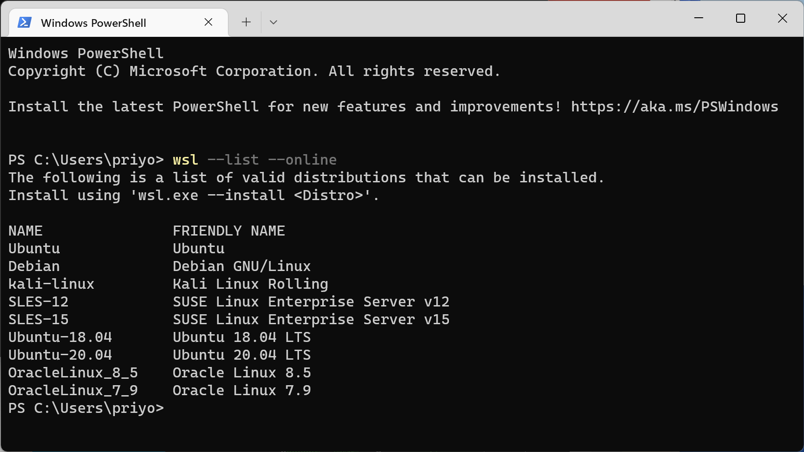
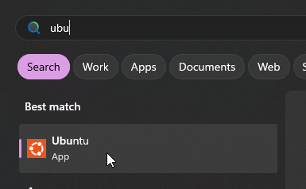
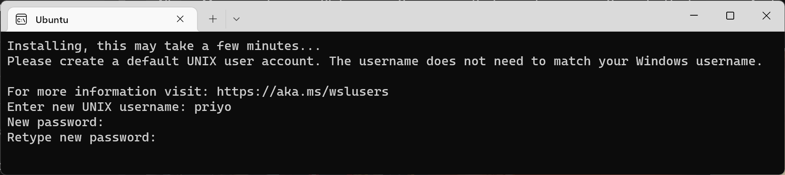
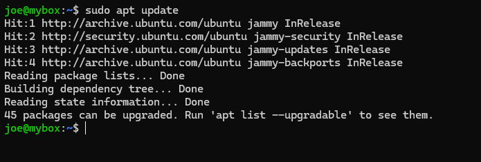
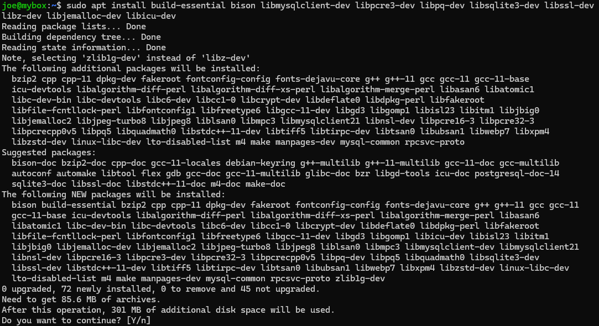
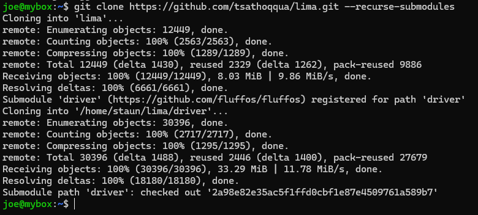
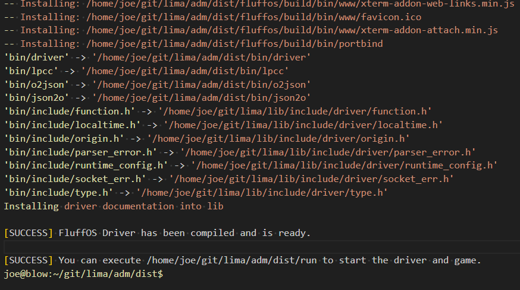

************
Installation
************

This is meant to be a rudimentary guide for getting you started with LIMA. Instead of building it directly on Windows, 
we recommend using Windows Subsystem for Linux or a virtual machine if you do not have a Linux Server available. These come
cheap from most Linux hosting companies.

Requirements: 1 Gb of memory and 1 Gb of disk should be plenty.

See https://www.fluffos.info/build.html for more options for building FluffOS.

Windows Subsystem for Linux (WSL)
---------------------------------

1. Open a Powershell or command prompt on Windows and do ``wsl --list --online`` to see which distributions are available for your Windows system.

2. Install Windows Subsystem for Linux - we recommmend Ubuntu, but up to you. 
   Make sure to enable Windows Subsystem for Linux (Google this if you have WSL issues). You should not need 
   to use administrator on your PC:

    ``wsl --install -d Ubuntu``

3. Start the wsl. Could be done with simply pressing your windows key and searching for "ubuntu" or "debian", and clicking
   the icon. You might need to restart Windows after installing WSL.

4. Set a username and a password for your Linux:

5. Update apt, and install packages needed for compiling FluffOS

    |   ``sudo apt update``

Then install prerequisites for Ubuntu:

    |   ``sudo apt install build-essential bison libmysqlclient-dev libpcre3-dev libpq-dev libsqlite3-dev libssl-dev libz-dev libjemalloc-dev libicu-dev cmake git``

or for Debian:

    |   ``sudo apt install build-essential bison libmariadb-dev libmariadb-dev-compat libpcre3-dev libpq-dev libsqlite3-dev libssl-dev zlib1g-dev libjemalloc-dev libicu-dev cmake git``

(These packages are prone to change, so modify as needed - it is not possible to keep chasing changes in versions and package names)

    |   ``sudo apt install build-essential bison libmysqlclient-dev libpcre3-dev libpq-dev libsqlite3-dev libssl-dev libz-dev libjemalloc-dev libicu-dev cmake``

6. Clone LIMA sources from github:

    |   ``git clone https://github.com/limalib/lima.git --recurse-submodules -b stable`` (stable)
    |   ``git clone https://github.com/limalib/lima.git --recurse-submodules`` (development)

7. Use --recurse-submodules to checkout the fluffos driver submodule. You can decide not to and use another driver if you want. LIMA comes with a build script after checking out the files:

    |    ``cd lima/adm/dist``   
    |    ``./rebuild``

    Lots of output will follow, and the final screen will say something like:

8. If you get complaints about missing dependencies here, try to install them via ``apt install`` or use ``apt search`` to find them.
    |    ``sudo apt install libssl3``
    |    (Just an example)

9. After build has completed, try:

    ``./run``

10. You might see a few warnings, but should be able to telnet to localhost 7878 (or use Mudlet from https://www.mudlet.org/). It is also possible to set up your MUD to use Websockets and then visit http://localhost:7878/ in your favourite browser. This can be reconfigured in the ``config.mud`` in the adm/dist directory of LIMA.

Ubuntu
------

Same as above, except you can skip directly to step 4.

Apache TLS Setup
----------------

To setup FluffOS with a secure, encrypted connection, it will be useful to have an Apache with a TLS setup. The next section will describe how to use these certificates with FluffOS.

Connect as root user:

    |   ``ssh root@domain-name``

Setup Certbox:
   |   ``snap install core``
   |   ``snap refresh core``
   |   ``snap install --classic certbot``
   |   ``ln -s /snap/bin/certbot /usr/bin/certbot``

Utilize the LDMud deploy hook (which works equally well for FluffOS) to automatically copy renewed certs into mudlib directory:

   |   ``mkdir -p /etc/letsencrypt/renewal-hooks/deploy/``
   |   
   |   ``curl -o /etc/letsencrypt/renewal-hooks/deploy/fluffos-hook \``
   |       ``https://gist.githubusercontent.com/cpu/bec1601816db34bb8c9efeb3f78b37c5/raw/c73c7a0b5ce47318710227d25defcf5ae38fc209/ldmud-hook.py``
   |   
   |   ``chmod +x /etc/letsencrypt/renewal-hooks/deploy/fluffos-hook``

Adjust the line for `certs_path` in `/etc/letsencrypt/renewal-hooks/deploy/fluffos-hook` to point to where TLS certificates will be stored in the mudlib. For example:

   ``certs_path = f"{mud_home}/lib/secure/etc/tls"``

Then:
   ``certbot --apache``

https://domain-name should nowconnect and display.

FluffOS TLS Setup
-----------------

Seed initial certificates to mudlib:

   |   ``certbot --force-renewal``

If it doesn't work, you can manually set up the initial files:
   |   ``cp /etc/letsencrypt/live/`Server Domain Name`/fullchain.pem ~mud/game/lib/secure/etc/tls/`Server Domain Name`.crt``
   |   ``cp /etc/letsencrypt/live/`Server Domain Name`/chain.pem ~mud/game/lib/secure/etc/tls/`Server Domain Name`.issuer.crt``
   |   ``cp /etc/letsencrypt/live/`Server Domain Name`/privkey.pem ~mud/game/lib/secure/etc/tls/`Server Domain Name`.key``
   |   ``chown mud:mud ~mud/game/lib/secure/etc/tls/*.pem``

Adjust mudlib config:
   |   ``vi /home/mud/game/nm3.cfg``

Add a telnet port with TLS, pointing to the certificates from the previous step:
   |   ``external_port_2: telnet 6667``
   |   ``external_port_2_tls: cert=secure/etc/tls/`Server Domain Name`.crt key=`Server Domain Name`.key``

More details on this at https://github.com/michaelprograms/fluffos-tutorial.
