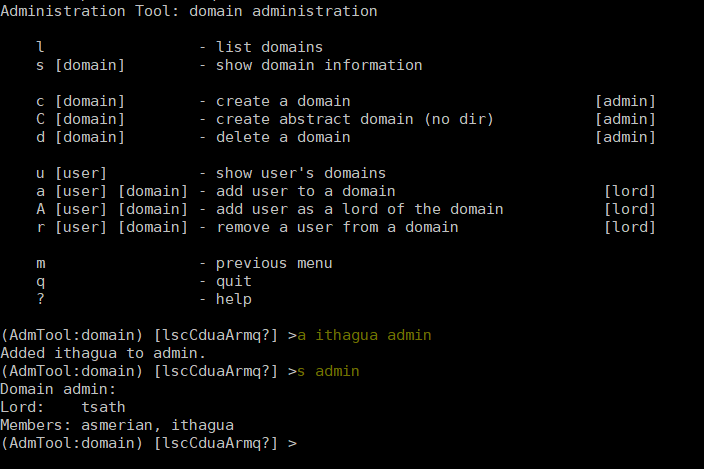
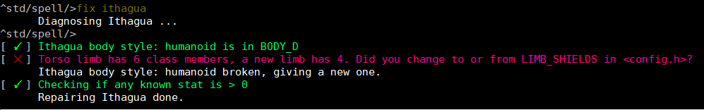

Frequently asked questions
==========================

.. contents::
   :local:

This FAQ describes commands in shorthand like
:menuselection:`menu --> i --> f` 

This tells you the commands you need to type and in which order. In this case first ``menu``
then ``i`` and then ``f``.

..
  Frequently asked questions should be questions that actually got asked.
  Formulate them as a question and an answer.
  Consider that the answer is best as a reference to another place in the documentation.

Initial woes
------------

I compiled the driver, what now?
~~~~~~~~~~~~~~~~~~~~~~~~~~~~~~~~
After running the ``rebuild`` script under ``adm/dist/`` you should:
   1. Edit ``config.mud`` file in same directory to adapt your settings.
   2. Edit the MUD ``name :``
   3. Change the default port to fit your server ``external_port_1: telnet ____``.

That's it! Run the mud by running ``./run`` or ``./run bg`` to run the MUD in a loop
in the background. To stop it later, just do ``./run stop``.

Does Lima work on Windows?
~~~~~~~~~~~~~~~~~~~~~~~~~~
Yes, if you use Windows Subsystem for Liux (WSL). See the :doc:`installation <Installation>` for more information.

Does Lima work with other drivers ?
~~~~~~~~~~~~~~~~~~~~~~~~~~~~~~~~~~~
No - it was written specifically for MudOS, now FluffOS. It could be converted for other drivers (eg LDMUD or DGD),
but that would involve a lot of work. The driver is the core of the MUD, and changing it would be a huge task.

Does Lima work on OS X? (or other versions of Linux)?
~~~~~~~~~~~~~~~~~~~~~~~~~~~~~~~~~~~~~~~~~~~~~~~~~~~~~
It should do. However we don't test on all versions. Report any problems compiling the driver on 
GitHub or LIMA (limamudlib.dev:7878). It would be most interesting to know if it works on OS X, as it is
a popular platform for developers.

Why doesn't the mud work - says it can't find the mudlib directory?
~~~~~~~~~~~~~~~~~~~~~~~~~~~~~~~~~~~~~~~~~~~~~~~~~~~~~~~~~~~~~~~~~~~
This usually means faulty filepaths in config.mud in the adm/dist folder.
Usual problems are either not getting the correct absolute filepath.
The mudlib directory should be the directory where the mudlib is located - check that it is correct
and existing folder.

Why don't my code changes have any effect?
~~~~~~~~~~~~~~~~~~~~~~~~~~~~~~~~~~~~~~~~~~
First, :doc:`update <command/update>`  update" the changed file, to make sure it compiles without error.
Generally objects already in the mud will still use the "old" code,
and only newly created objects will use the "new" code.
Using the :doc:`renew command <command/renew>` on an old object should replace the "old" code
with the "new" code. You may also need to use `update -R` on objects which inherit the code
that you have changed. If all else fails, try rebooting the mud. However, make sure that
you've not "broken" any critical files (eg. anything inherited by the
user or body), which would stop the mud from booting, or stop you from logging in. Check the
driver log should this happen in the log folder.

I've broken the mud, and it won't boot. What do I do?
~~~~~~~~~~~~~~~~~~~~~~~~~~~~~~~~~~~~~~~~~~~~~~~~~~~~~
Restore the mud from the last backup. Use ``git restore`` on the file or ``git diff`` to see what you changed.
Otherwise, restore the broken file from its last backup if you do not use git.

How can I learn LPC?
~~~~~~~~~~~~~~~~~~~~
See the learning path tutorials here on this website. They are split into sveral parts with exercises.

How do I call functions from the command line / shell prompt?
~~~~~~~~~~~~~~~~~~~~~~~~~~~~~~~~~~~~~~~~~~~~~~~~~~~~~~~~~~~~~
Use the ``@`` command - eg ``@.me->query_health()``
Details are available in the shell help (Just type ``?`` from the shell prompt).

Why do ``add_action()``s not work?
~~~~~~~~~~~~~~~~~~~~~~~~~~~~~~~~
The short answer:  They have deliberately been disabled, as they are far inferior to verbs, and should not be used.

The longer answer: Lima does not use ``add_action()`` at all; it uses verbs instead.
Absolutely nothing remotely similar to ``add_action()`` exists in the lib.
It is completely impossible for a room or object to add new commands
to the game.

The reason for this is consistency.  With the Lima lib, things work
the same everywhere, making things much easier to understand.  Of
course, many things may not do anything interesting; however they
should at least give a reasonable error message.  For example, if
there is anything in the MUD that can be twisted, it makes more sense
for *everything* to be able to be twisted, and simply do nothing,
instead of each object which can be twisted having to completely
reimplementing the concept.

The ``add_action()`` way of doing things leads to lots of code
duplication, and in many cases poor parsing since the person writing
the command is more interested in getting it to work for him than
doing any sort of general parsing; in many cases the person in
question is an area coder with little mudlib experience anyway.  As
anyone who has worked extensively with ``add_action()`` knows, bringing
any two such objects into close proximity often results in complete
disasters, and rarely even succeeds in generating the correct error
message for most commands.

Why is IMUD_D complaining and how to fix it?
~~~~~~~~~~~~~~~~~~~~~~~~~~~~~~~~~~~~~~~~~~~~
IMUD_D requires a valid email set in ``/include/config.h`` under:

.. code-block:: c

   /* The administrator(s)' email address(es).
    * NOTE: This is required to be changed in order to have a working
    * I3/IMUD_D system. Must be changed for anything to work!
    */
   #define ADMIN_EMAIL "billg@microsoft.com"

Once that has been changed, log in to your MUD, and do 

   |  ``update `IMUD_D```

and it should then load. If you are in doubt about setting ADMIN_EMAIL correctly, you can
print it from your wizard shell like this:

   |  ``@ADMIN_EMAIL``

And it will print your define.

Why am I getting "Too long evaluation. Execution aborted."?
~~~~~~~~~~~~~~~~~~~~~~~~~~~~~~~~~~~~~~~~~~~~~~~~~~~~~~~~~~~

This is usually caused by your MUD host being a bit on the slow side, and slowing down
the call_out() rate the daemons use can help this. Go to ``/include/config.h``
and change this:

.. code-block:: c

   /* Delay factor for DAEMON call_outs(). 
    * Some daemons may be a bit too greedy for your machine causing:
    * "Too long evaluation. Execution aborted."
    * If you are getting these increase this number to 5, or 10.
    * Otherwise, enjoy your powerful machine, and keep it at 1.
    */
   #define TOO_GREEDY_DAEMONS 1

Change the 1 here to a higher number that will make the issue go away. You can try
5 or 10, and then possibly reduce it a bit once the errors stop nagging you.

Alternatively, upgrade your hosting to a bigger potato. 🥔

How do I get the didlog working?
~~~~~~~~~~~~~~~~~~~~~~~~~~~~~~~~

:menuselection:`didlog -newversion 0.0.1`
:menuselection:`I did something`

When you first start the MUD, you will get a message like:

    |  No active mudlib version. Set your first version with:
    |  didlog -newversion 0.0.1
    |  didlog -help (for more)

This is the didlog system complaining that you need to set a new version. The didlog
is a system where you and your team of wizards can log your changes and make it easier
to cooperate. First, create a new version:

    |  ``didlog -newversion 0.0.1``
    |  ``I created the first didlog for version 0.0.1! Woo!``

Yes, "I" is a command, try it out, like above!

This will give you a warning ``Sorry, but only full wizards may use the didlog.``. 
But you are an admin? What is going on? Simple, LIMA supports guest wizards, and
full wizards and guest wizards are separated by having a home directory. So, 
go create a directory for yourself.

    |  cd /wiz
    |  mkdir bob

If your name is Bob - use the right name here, obviously. Then try didlog again:

    |  I tests the didlog system.
    |  didlog

Now, you can see your didlog entry in the didlog, and you will not see the warning
when logging in again. Talk to your wizard team on when to create a new version 0.0.2
or even 1.0 at some point. Happy didlogging!

.. tip::

    You can undo a didlog by doing ``@DID_D->someone_didnt()``, if you regret
    or one of your fellow developers made a boo-boo.

Administration
--------------

How do I make someone admin?
~~~~~~~~~~~~~~~~~~~~~~~~~~~~

:menuselection:`admtool --> 1 --> d --> a [user] admin`

When you first logged in, you were automatically set to be admin. The 
:doc:`who <player_command/who>` command will confirm this.

To make another person admin, add them to the admin domain using the admtool.
They need to be a wizard already to become an admin.



  Example of the making an existing wizard admin.

How do I (de)wiz someone?
~~~~~~~~~~~~~~~~~~~~~

:menuselection:`admtool --> 1 --> u --> w [name]`
:menuselection:`admtool --> 1 --> u --> d [name]`

If you have defined ``AUTO_WIZ`` in ``/include/config.h``, everyone logging In
will be a "guest wizard". If you want to make them full wizards, you need to create
a home directory under /wiz/ matching their login name.

If you have turned off ``AUTO_WIZ``, you can use the :doc:`admtool <command/admtool>`
to change players into wizards or vice versa. Open the admtool, go to privilege 1 
(that is admin only), go to user, then use the "wiz a user" option to wiz or "dewiz"
if needed.

A wizard has issues writing to his folder under /wiz?
~~~~~~~~~~~~~~~~~~~~~~~~~~~~~~~~~~~~~~~~~~~~~~~~~~~~~

:menuselection:`admtool --> 1 --> u --> d [name]`
:menuselection:`admtool --> 1 --> u --> w [name]`

The wizard will get an error about not being able to write to their folder even when it was created:

   |  ``Permission denied: /wiz/tsath/exec.c.``

The most likely cause is that you have ``AUTO_WIZ`` on, and you created the folder manually.
The ``SECURE_D`` still needs to assign permissions for the wizard to the folder. The simple way
of fixing this is to dewiz and wiz them again using the :doc:`admtool <command/admtool>`.

.. note::

    This permissions could be added automatically when ``AUTO_WIZ`` is on as soon as the wizard
    joins the MUD. This is not a great idea, since you will likely accumulate a lot of unused security
    rules for people that just stopped by and left - never to be seen again.

    You know who is staying and gets to be a full wizards, and who is just a guest - the system
    cannot know.

Configuration
-------------

What does USE_INTRODUCTIONS change in config.h?
~~~~~~~~~~~~~~~~~~~~~~~~~~~~~~~~~~~~~~~~~~~~~~~
Enabling this option in ``config.h`` hides player names for other players in some very specific situations:
   1. Players passing through rooms (entering and leaving).
   2. Players saying something in rooms with other players.
   3. Players whispering to other players in rooms.

As an example, a player whispering another player in a room will be seen by other players as:

   |  A strong orc whispers something to a tall beautiful elf.

The players can introduce themselves to each other via the ``introduce`` verb. Either to one person in the room
or the entire room. After being introduced, they will show up normally by name.

LIMA relies heavily on a centralized parsing structure where all messages for receivers are created at once.
The parsing allows the messages to be created for the sender, the other person involved, 
and the rest of people in the room. This system is very effective, and widely used for 
combat, emotes, verbs and  other in-room actions and is not recommended to be changed.

Short version: If players want to keep their identity hidden, do not do emotes or actions.

A lot of options in config.h changed, and now bodies are broken?
~~~~~~~~~~~~~~~~~~~~~~~~~~~~~~~~~~~~~~~~~~~~~~~~~~~~~~~~~~~~~~~~
Having issues with bodies and limbs not working after changing something in ``config.h``?
Then you can likely fix the issue, by renewing limbs and bodies for impacted players and yourself.

The easiest way to do this is by using the :doc:`fix <command/fix>` command. Examples of use:

   | fix me
   | fix tsath

This will recreate the body and limbs for the player, and they should be back in business. As LIMA
evolves this command will updated to fix more issues, and we rely on the community to report issues
in case they are not fixed by the command. Do reach out to the LIMA team if you have issues that are
not fixed by the command regarding bodies.

When doing this the player will see something like:

   |  ``Your body is being diagnosed by Tsath. Leave combat, then stand still.``
   |  ``Your body has been repaired. Feel any better?``

It is important to leave combat before doing this, as the body may bug out while in combat.



  Example of a body in need of fixing using the fix command.

I changed one of the default colours, but it had no effect. Why?
~~~~~~~~~~~~~~~~~~~~~~~~~~~~~~~~~~~~~~~~~~~~~~~~~~~~~~~~~~~~~~~
In the colour settings in the :doc:`admtool <command/admtool>`, you can set the default colours for the MUD.
These colours are not automatically applied to existing characters. If you change the default colours,
you need to remove the old colour settings for the characters to get the new default colours.

Your colour settings will have been set to the old default colours. To change to a new one, clear the old one.
In the :doc:`colours command <player_command/colours>`, use the ``colours remove <whatever>`` syntax. 
Any newly created characters will automatically start with the current default colour settings.

Other topics
------------

Why is the suicide command disabled?
~~~~~~~~~~~~~~~~~~~~~~~~~~~~~~~~~~~~
Because it doesn't work properly in its current form.
The security system prevents a player command accessing secure data,
so the deletion fails. If you want to enable it, look at how the "finger" command uses redirection
to a command in the /trans/cmds/ directory, and daemons in the /secure/
directory to achieve access to secure player data.

How do players customise the prompt to show hit points etc?
~~~~~~~~~~~~~~~~~~~~~~~~~~~~~~~~~~~~~~~~~~~~~~~~~~~~~~~~~~~
They don't.

LIMA's health system was written to reduce processor load by only calculating halth (hit points) when required.
If you calculate that every time a command is entered, you have wiped out most of that gain.
The system is also modular, with options for using limb- or wound-based health,  which would probably 
be too detailed to display in a prompt. It may be useful to add a display each round during combat, in which case
look at ``/std/adversary/main.c`` for the main combat loop.
